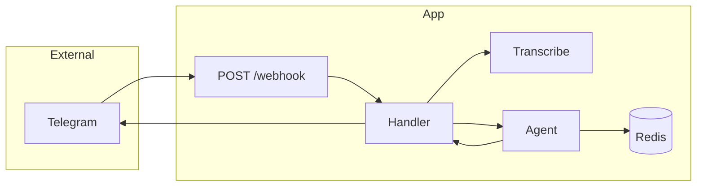

<!-- Improved compatibility of back to top link: See: https://github.com/othneildrew/Best-README-Template/pull/73 -->
<a id="readme-top"></a>

<!-- PROJECT LOGO -->
<br />
<div align="center">
  <a href="https://github.com/nomomon/rat-assistant-tg-bot">
    
  </a>

<h3 align="center">Rat Assistant Telegram Bot</h3>

  <p align="center">
    Telegram bot with Pydantic AI (Gemini), webhooks, Whisper voice, and Redis-backed 1-hour context per user.
    <br />
    <a href="#getting-started"><strong>Get Started »</strong></a>
    <br />
    <br />
  </p>
</div>


<!-- TABLE OF CONTENTS -->
<details>
  <summary>Table of Contents</summary>
  <ol>
    <li>
      <a href="#about-the-project">About The Project</a>
    </li>
    <li>
      <a href="#getting-started">Getting Started</a>
      <ul>
        <li><a href="#prerequisites">Prerequisites</a></li>
        <li><a href="#installation">Installation</a></li>
        <li><a href="#docker-compose">Docker Compose</a></li>
      </ul>
    </li>
    <li><a href="#api--endpoints">API / Endpoints</a></li>
    <li><a href="#how-it-works">How It Works</a></li>
    <li><a href="#contributing">Contributing</a></li>
    <li><a href="#license">License</a></li>
    <li><a href="#contact">Contact</a></li>
  </ol>
</details>


<!-- ABOUT THE PROJECT -->
## About The Project

This project is a small, focused Telegram bot that lets you talk to a Gemini-powered assistant directly from Telegram using both text and voice messages. The backend is built with **FastAPI** and **Pydantic AI**, and integrates **OpenAI Whisper** to transcribe incoming voice messages before passing them to the agent.

Telegram webhook updates are handled by a FastAPI app, which verifies an optional secret header, whitelists users by ID, and then routes text or transcribed audio through a Pydantic AI agent configured with Gemini and web search. Conversation history is stored in **Redis** with a **1-hour sliding window** per user, so the assistant can stay in context without unbounded growth.

**Key Features:**
- **FastAPI webhook backend:** Minimal, focused app exposing `POST /webhook` and `GET /health`.
- **Pydantic AI + Gemini:** Agent defined in `src/agent/agent.py` using Gemini and the built-in web search tool.
- **Configurable persona:** System prompt is loaded from `src/agent/prompt.md` (default: Russian-speaking “Крысятыч” homework helper).
- **Voice support via Whisper:** Voice messages are downloaded from Telegram and transcribed with OpenAI Whisper (`whisper-1`) before being passed to the agent.
- **Redis-backed context:** Per-user conversation history stored in Redis, keeping only messages from the last hour.
- **User whitelist:** Only Telegram user IDs listed in `ALLOWED_TELEGRAM_USER_IDS` can use the bot.
- **Docker-friendly:** Dockerfile and `docker-compose.yml` provided for running the bot and Redis together.

<p align="right">(<a href="#readme-top">back to top</a>)</p>


<!-- GETTING STARTED -->
## Getting Started

To get a local copy up and running, follow these steps.

### Prerequisites

Make sure you have the following installed:

- **Python**: 3.10 or higher
- **Redis**: running locally or accessible via URL (for conversation history)
- **Package manager**: either
  - [uv](https://docs.astral.sh/uv/) (recommended), or
  - `pip` and a virtual environment

You will also need:

- A **Telegram bot token** from [BotFather](https://core.telegram.org/bots#3-how-do-i-create-a-bot).
- An **OpenAI API key** for Whisper.
- A **Google / Gemini API key** for the Gemini model.

### Installation

1. **Clone the repository**

   ```sh
   git clone https://github.com/nomomon/rat-assistant-tg-bot.git
   cd rat-assistant-tg-bot
   ```

2. **Install dependencies**

   Using **uv** (recommended):

   ```sh
   uv sync
   ```

   Or using **pip**:

   ```sh
   pip install -e .
   ```

3. **Environment setup**

   Copy `.env.example` to `.env` and fill in your values:

   ```sh
   cp .env.example .env
   ```

   **Required variables:**

   - `TELEGRAM_BOT_TOKEN` or `TELEGRAM_BOT_KEY` – bot token from BotFather.
   - `OPENAI_API_KEY` – OpenAI API key (used for Whisper transcription).
   - `GOOGLE_API_KEY` or `GEMINI_API_KEY` – Google / Gemini API key for the Gemini model.
   - `ALLOWED_TELEGRAM_USER_IDS` – comma-separated list of Telegram user IDs that are allowed to use the bot.

   **Optional variables:**

   - `WEBHOOK_SECRET_TOKEN` – if set, incoming webhook requests must include this value in the `X-Telegram-Bot-Api-Secret-Token` header.
   - `REDIS_URL` – Redis connection URL for conversation history (defaults to `redis://localhost:6379/0`).

4. **Run the application**

   Make sure Redis is running and accessible (e.g. on `localhost:6379`), then start the FastAPI app:

   ```sh
   uvicorn src.main:app --host 0.0.0.0 --port 8000
   ```

5. **Set the Telegram webhook (once)**

   After the app is reachable at a public HTTPS URL, set the webhook using the provided script:

   ```sh
   python -m scripts.set_webhook https://your-domain.com/webhook --secret YOUR_SECRET
   ```

   - Use the same `YOUR_SECRET` value as `WEBHOOK_SECRET_TOKEN` in `.env`.
   - Omit `--secret` if you are not using a webhook secret.
   - For local testing, you can expose `http://localhost:8000` via a tool like `ngrok` and use the generated HTTPS URL.

<p align="right">(<a href="#readme-top">back to top</a>)</p>


### Docker Compose

You can run the bot and Redis together using Docker Compose.

1. **Prepare environment**

   ```sh
   cp .env.example .env   # edit with your keys
   ```

2. **Start services**

   ```sh
   docker compose up --build
   ```

   This will:

   - Start a Redis instance.
   - Build and run the FastAPI app container, with `REDIS_URL` set to `redis://redis:6379/0`.

   In `docker-compose.yml`, the app’s port mapping (`8000:8000`) is commented out. Uncomment it if you want to access the app directly at `http://localhost:8000` from your host.

3. **Set the webhook**

   Once the app is accessible at a public HTTPS URL, run the same webhook script (either from inside the app container or from your host if you expose the port) and point it to:

   ```text
   https://your-domain.com/webhook
   ```

<p align="right">(<a href="#readme-top">back to top</a>)</p>


<!-- API / ENDPOINTS -->
## API / Endpoints

- `POST /webhook` – Telegram sends updates here. The app:
  - Optionally checks `X-Telegram-Bot-Api-Secret-Token` against `WEBHOOK_SECRET_TOKEN`.
  - Validates and parses the update.
  - Whitelists the user based on `ALLOWED_TELEGRAM_USER_IDS`.
  - Resolves text or transcribes voice, runs the agent with history, and sends a reply.
  - Always responds with HTTP 200 quickly while processing in the background.

- `GET /health` – Simple liveness check returning `{"status": "ok"}`.

<p align="right">(<a href="#readme-top">back to top</a>)</p>


<!-- HOW IT WORKS -->
## How It Works

At a high level, the flow looks like this:

1. Telegram sends updates to `POST /webhook`.
2. The webhook handler checks the optional secret header and user whitelist.
3. The message is interpreted as either text or a voice message (which is downloaded and transcribed with Whisper).
4. The Pydantic AI agent is called with the user message and the last hour of conversation history from Redis.
5. The agent’s new messages are appended back to Redis, and the reply is sent to the user.



The agent configuration (model, tools, and instructions) lives in `src/agent/agent.py` and `src/agent/prompt.md`, while the history handling is implemented in `src/services/history.py`.

<p align="right">(<a href="#readme-top">back to top</a>)</p>


<!-- CONTRIBUTING -->
## Contributing

Contributions are welcome and appreciated.

If you have ideas or improvements, feel free to fork the repo and open a pull request, or create an issue with the label `enhancement`.

1. Fork the repository
2. Create your feature branch (`git checkout -b feature/AmazingFeature`)
3. Commit your changes (`git commit -m 'Add some AmazingFeature'`)
4. Push to the branch (`git push origin feature/AmazingFeature`)
5. Open a Pull Request

<p align="right">(<a href="#readme-top">back to top</a>)</p>


<!-- LICENSE -->
## License

This project is currently unlicensed. If you plan to use it in production or distribute modified versions, consider adding an appropriate `LICENSE` file (for example, MIT).

<p align="right">(<a href="#readme-top">back to top</a>)</p>


<!-- CONTACT -->
## Contact

Mansur Nurmukhambetov – [@nomomon](https://github.com/nomomon)

Project Link: [https://github.com/nomomon/rat-assistant-tg-bot](https://github.com/nomomon/rat-assistant-tg-bot)

<p align="right">(<a href="#readme-top">back to top</a>)</p>


<!-- MARKDOWN LINKS & IMAGES -->
[FastAPI]: https://img.shields.io/badge/FastAPI-005571?style=for-the-badge&logo=fastapi
[FastAPI-url]: https://fastapi.tiangolo.com/
[Python]: https://img.shields.io/badge/Python-3776AB?style=for-the-badge&logo=python&logoColor=white
[Python-url]: https://www.python.org/
